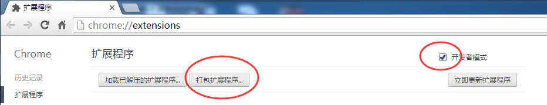
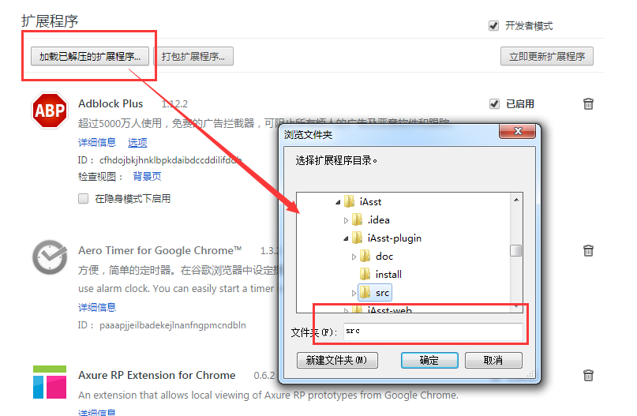
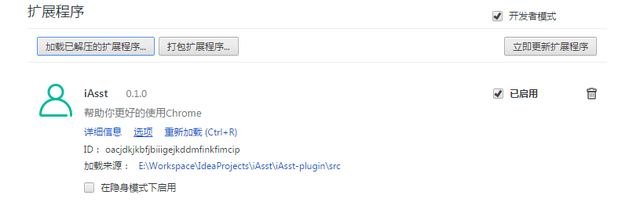
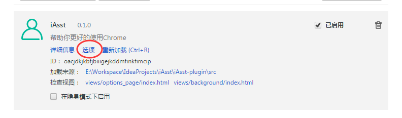
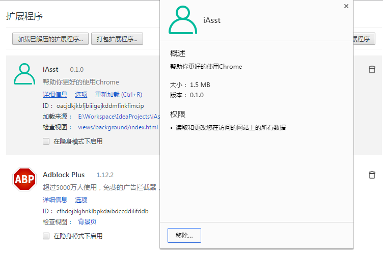
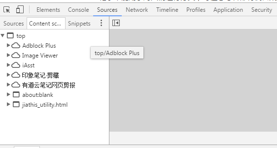

# Chrome插件调试

## 安装源码步骤
1. 打开chrome浏览器的扩展程序设置，通过点击或这个在浏览器地址栏输入`chrome://extensions/`
> 

2. 勾选【开发者模式】，会出现如下图的功能按钮
> 

3. 点击【加载已解压的扩展程序】，在弹出的目录对话框中输入插件源码目录，点击【确定】即可
> 

4. 点击确定后，会在扩展程序界面看到新加入的插件
> 

## 调试
chrome插件的调试和普通web页面调试基本一致，但还有些技巧可言参考

1. 在编辑器修改后，可以在扩展程序页面找到插件，点击重新加载，会加载修改的源码
> 

2. 点击详细信息可以看到插件申请的权限和插件大小
> 

3. 内容脚本的调试在匹配的页面上F12，选择【Sources】，将出现的选项卡切换到【Content scripts】并找到本插件即可
> 