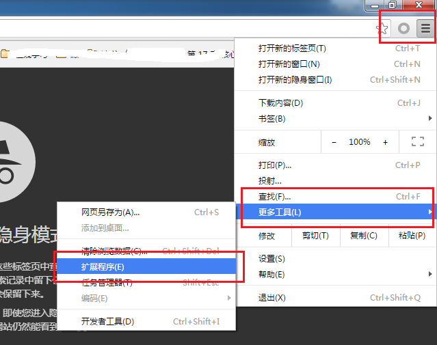
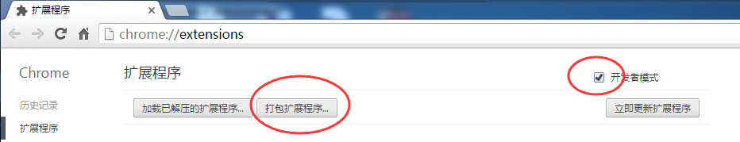
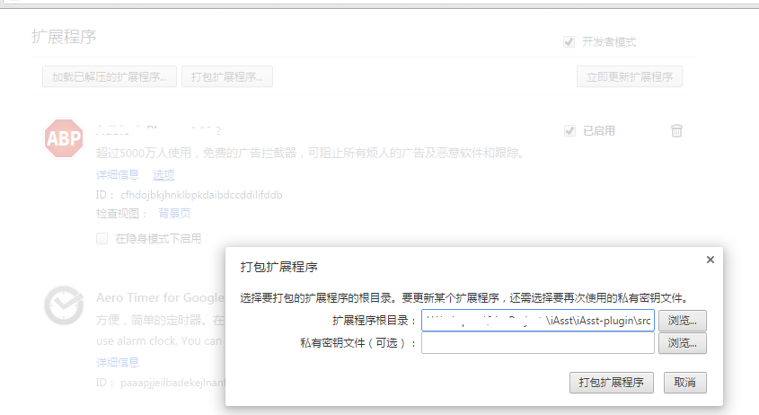
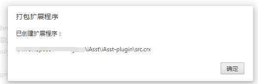
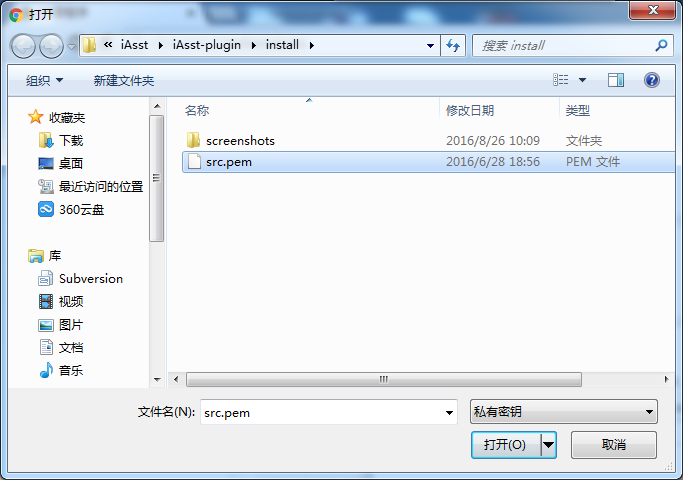
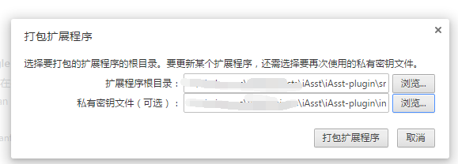

# Chrome插件打包

## 概述
1. chrome插件的打包依赖`Google Chrome`浏览器
2. 插件打包提供了两种方式
	1. 在chrome浏览器上通过图形界面打包
	2. 使用我提供的BAT脚本[`plugin-package.bat`](plugin-package.bat)

## 打包过程
### 图形界面方式打包
1. 打开chrome浏览器的扩展程序设置，通过点击或这个在浏览器地址栏输入`chrome://extensions/`
> 

2. 勾选【开发者模式】，会出现如下图的功能按钮
> 

3. 点击【打包扩展程序】，弹出打包界面，在【扩展程序根目录】中输入插件源码目录，注意，打包后的名字用的是目录名
> 

4. 如果未打包过，直接点击【打包扩展程序】即可，会在插件源码目录的上级mule产生一个打包好的插件安装文件`src.crx`和一个私有密钥文件`src.pem`
> 

5. 如果打包过，并且准备升级插件，需要在【私有密钥文件】中填入之前生成的pem文件，如下图，再点击【打包扩展程序】
> 
> 

6. 至此，打包成功

### 执行脚本打包
1. 双击install目录下的打包脚本`plugin-package.bat`，会在目录下生成插件安装文件`iAsst.crx`
2. 打包脚本说明
	1. 脚本文件中包含了chrome的安装路径，如果提示找不到路径的话，请修改成本机的路径
	2. 脚本打包的只能在install目录下使用，移到其他目录请修改脚本的软连接创建部分
	3. 有私钥文件`iAsst.pem`的时候，会使用私钥打包，没有私钥的时候，全新打包并生成私钥文件